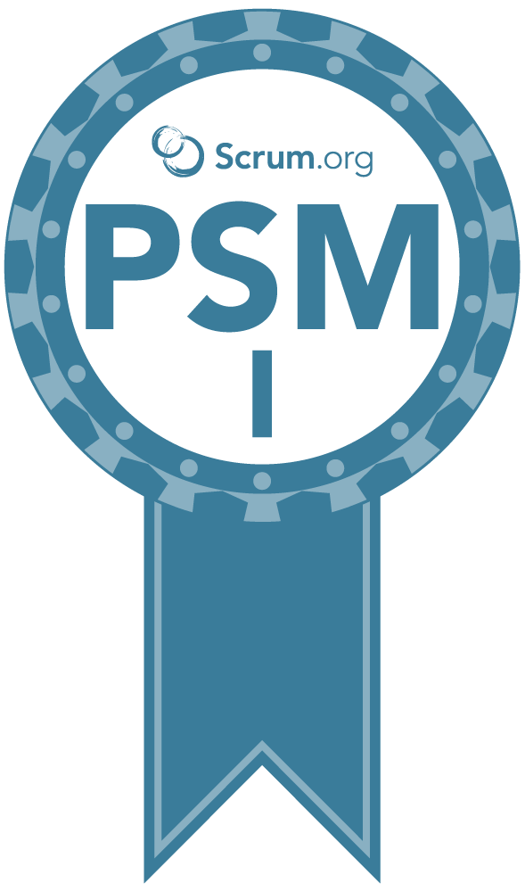

<h1 align="center">
  
</h1>

  <code>
    <a href="https://www.linkedin.com/in/alexey-semenyuk-60410b94/" title="LinkedIn Profile"> LinkedIn</a></code>
  <code><a href="https://stackoverflow.com/users/2650960/alexey-semenyuk" title="Stack Overflow Profile"> Stack Overflow</a></code>
  <code><a href="https://www.scrum.org/user/517210" title="PSMI"> Professional Scrum Master™ I</a></code>

  

 

  

  
 
 
 \
        
  

   
 
  
